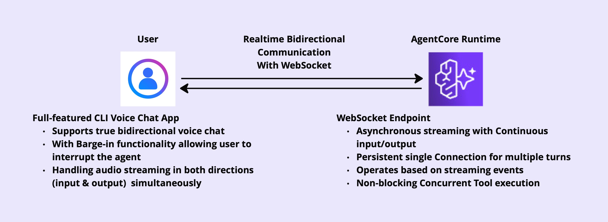

# BI-Directional Voice Agent

This repositories includes
- A bidirectional voice agent Websocket endpoint, using Nova2 Sonic and strands agent.
- A CDK Stack to deploy the agent on AgentCore Runtime
- A Full Featured CLI Client Voice Chat App that supports true bidirectional communication

For more information, please refer to my article [BiDirectional Voice Agent with AgentCore Runtime/ Nova2 Sonic / Strands Agents](https://medium.com/@itsuki.enjoy/bidirectional-voice-agent-with-agentcore-runtime-nova2-sonic-strands-agents-9f86371d0641)

For set up, local testing, and deployment, please refer to individual part.
1. [Backend Websocket Endpoint](./backend/README.md)
2. [CDK](./cdk/README.md)
3. [CLI App](./cli/README.md)

